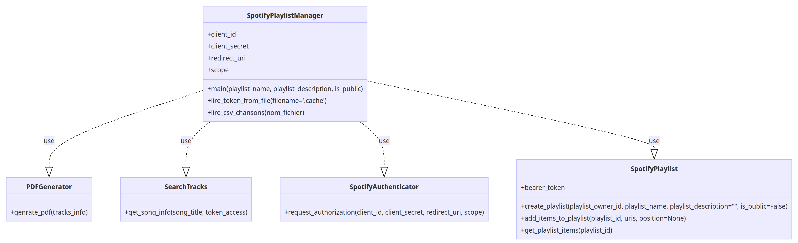

# Hitster - Documentation

**Hitster** est un jeu de quiz musical dans lequel les participants doivent retrouver le titre et l'artiste de différents titres populaires de différentes époques. Le jeu fonctionne à l'aide de cartes contenant un QR code redirigeant vers un extrait audio disponible sur Spotify, ainsi que la réponse au dos de la carte, comprenant une année, un artiste et le nom du titre.

## Table des matières

- [Prérequis](#prérequis)
- [Fonctionnalités](#fonctionnalités)
- [Processus](#processus)
- [Installation](#installation)
- [Utilisation](#utilisation)
- [Profiter du Jeu](#profiter-du-jeu)
- [Imprimer et Jouer](#imprimer-et-jouer)

## Prérequis

- Avoir un compte Spotify.
- Générer CLIENT_ID et CLIENT_SECRET à l'aide de l'API Spotify.
- Installer Python 3.x sur votre système.

## Fonctionnalités

- Récupérer les titres et artistes des chansons populaires de différentes époques.
- Générer des cartes liées à des codes QR pour chaque chanson, contenant :
  - Un lien vers un extrait audio de Spotify.
  - Le nom de l'artiste, le titre de la chanson et la date de sortie.
- Compiler une playlist des chansons identifiées à partir de la liste des singles numéro un en France de Wikipedia.
- Utiliser l'API Spotify pour rechercher chaque chanson et récupérer son extrait audio.
- Générer des fichiers PDF pour chaque chanson contenant le code QR et les informations sur la chanson.

## Processus

1. Récupération des informations des utilisateurs : l'utilisateur doit d'abord créer un compte sur l'API Spotify.
2. Génération d'un token d'accès stocké dans le fichier .cach, en utilisant la bibliothèque Spotipy.
3. Création de la playlist et récupération de ses informations.
4. Parcours d'un fichier CSV contenant des chansons."Vous pouvez choisir les chansons que vous voulez et les mettre dans le fichier chansons.csv sans toucher à la 1er ligne (Titre, Artiste)"
5. Pour chaque chanson, recherche des informations via son titre.
6. Récupération des URI nécessaires.
7. Ajout des URI à la playlist.
8. Parcours de la playlist pour récupérer les URL, dates et QR codes.



## Installation

Pour exécuter Hitster, suivez ces étapes :

1. Clonez ou téléchargez ce dépôt sur votre machine locale.
2. Installez les packages Python requis à l'aide de pip :


```bash
pip install -r requirements.txt
```

3. Configurez vos identifiants d'API Spotify en créant un fichier .env dans le répertoire du projet avec le format suivant :


```bash
CLIENT_ID=<Votre identifiant client Spotify>
CLIENT_SECRET=<Votre secret client Spotify>
REDIRECT_URI=<Votre URI de redirection Spotify>
```

## Utilisation

Pour utiliser Hitster, exécutez la commande suivante:
```bash
python hitster.py <votre_nom_de_playlist> <votre_description_de_playlist>
```
Remplacez <votre_nom_de_playlist> et <votre_description_de_playlist> par le nom et la description de votre playlist désirée.

## Profiter du Jeu : 
Hitster recherchera des chansons populaires, générera des cartes liées à des codes QR et les compilera dans une playlist prête à être imprimée.
## Imprimer et Jouer :
Une fois le processus terminé, vous disposerez de fichiers PDF prêts à être imprimés. Amusez-vous à jouer au quiz musical avec vos amis et votre famille !
